# IyziTrace Documentation

A comprehensive OpenTelemetry-native observability platform built as a Grafana plugin. Transform your telemetry data into actionable insights with powerful visualization, AI-driven analysis, and intelligent service mapping.

---

## Table of Contents

<!-- !toc (minlevel=2 omit="Table of Contents") -->

* [Introduction](#introduction)
* [Platform Features Gallery](#platform-features-gallery)
  * [Infrastructure & Service Topology](#infrastructure--service-topology)
  * [Performance Monitoring](#performance-monitoring)
  * [Distributed Tracing](#distributed-tracing)
  * [Log Management](#log-management)
  * [AI-Powered Analysis](#ai-powered-analysis)
  * [Agent Management](#agent-management)
  * [Inventory Management](#inventory-management)
  * [Customization](#customization)
* [Get Started](#get-started)
  * [Installation](#installation)
  * [Setup Wizard](#setup-wizard)
  * [Initial Configuration](#initial-configuration)
  * [Quick Start Guide](#quick-start-guide)
* [Key Concepts](#key-concepts)
  * [Resources](#resources)
  * [Service Infrastructure Mapping](#service-infrastructure-mapping)
  * [Time Picker](#time-picker)
  * [Filtering](#filtering)
* [Features](#features)
  * [Landing Page](#landing-page)
  * [Overview](#overview)
  * [Service Map](#service-map)
  * [Services](#services)
  * [Traces](#traces)
  * [Logs](#logs)
  * [Views](#views)
  * [Exceptions](#exceptions)
  * [AI Assistant](#ai-assistant)
  * [Agent Manager](#agent-manager)
  * [Inventory Manager](#inventory-manager)
* [Configuration](#configuration)
  * [Settings](#settings)
  * [Datasources](#datasources)
  * [Definitions](#definitions)
  * [AI Configuration](#ai-configuration)
* [Access Control](#access-control)
  * [Teams](#teams)
  * [Page Permissions](#page-permissions)
* [Advanced Features](#advanced-features)
  * [Service-Infrastructure Mapping](#service-infrastructure-mapping)
  * [Orphan Services](#orphan-services)
  * [Search and Filter](#search-and-filter)
* [API Reference](#api-reference)
* [FAQ](#faq)
* [Troubleshooting](#troubleshooting)

<!-- toc! -->

---

## Introduction

IyziTrace is a powerful observability platform designed to provide deep insights into your distributed systems. Built on OpenTelemetry standards and running as a Grafana plugin, it combines metrics, logs, and traces into a unified, intuitive interface.

### Infrastructure Monitoring, Without the Heavy Lift

Collect metrics, logs, and traces in minutes. Zero-maintenance pipelines, transparent pricing, and deep context for faster debugging.

**Platform Highlights:**

- **10s install time** - Get up and running in seconds
- **99.95% uptime** - Enterprise-grade reliability
- **OpenTelemetry native** - Built on open standards
- **Usage-based pricing** - Transparent, predictable costs

### What is IyziTrace?

IyziTrace offers:

- **Unified Observability**: Seamlessly correlate metrics, logs, and traces
- **Service-Centric View**: Understand your microservices architecture at a glance
- **Infrastructure Monitoring**: Real-time insights into your hosts and containers
- **AI-Powered Analysis**: Get intelligent recommendations and anomaly detection
- **Agent Management**: Manage and monitor OpenTelemetry collectors remotely
- **Inventory Management**: Track and discover all infrastructure entities and relationships
- **OpenTelemetry Native**: Built on open standards for maximum compatibility

### Why IyziTrace?

**Observability Only You Need**

No complex setups, no maintenance — all the context for your logs, metrics and traces.

- **Full-stack Infrastructure Overview**: See servers, runtimes, services and operations in a single layered view. From CPU usage to business operations, IyziTrace gives you an instant, end-to-end snapshot of your system health.

  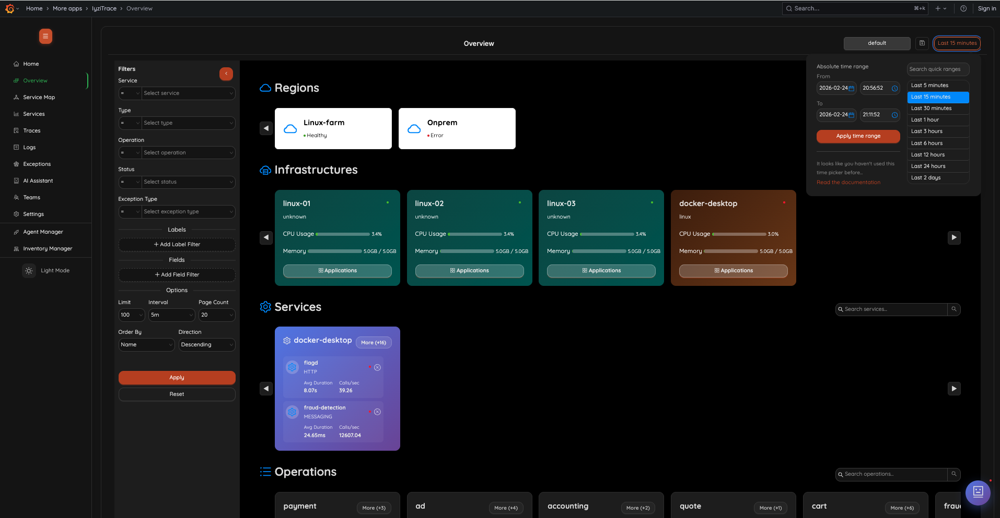

- **Service Dependency Topology**: Visualize all services and their dependencies as interactive service maps. Click any node to see details including infrastructure info, resources, health status, and connected applications.

  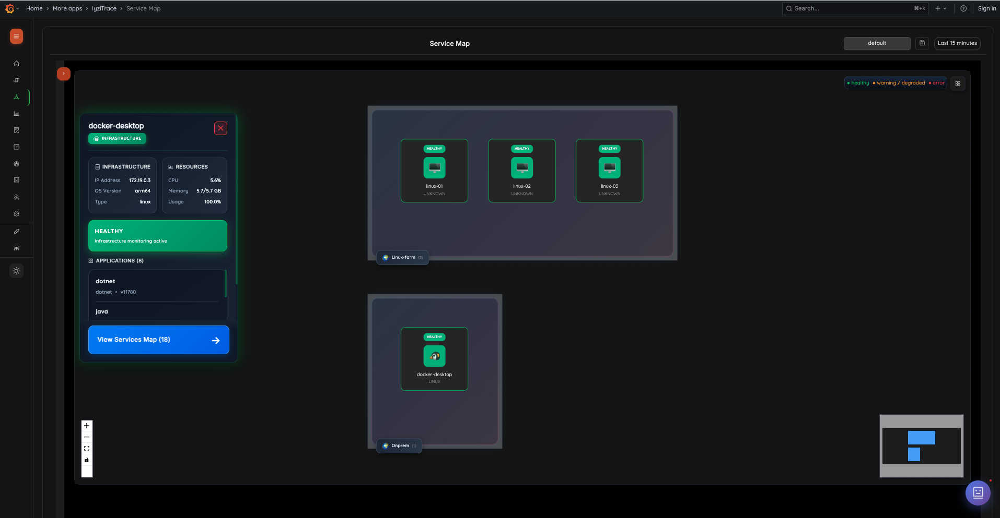

- **Deep Service Performance**: Drill into individual services to analyze latency percentiles (P50, P75, P90, P95, P99), throughput, Apdex scores, and operation rates with real-time performance charts.

  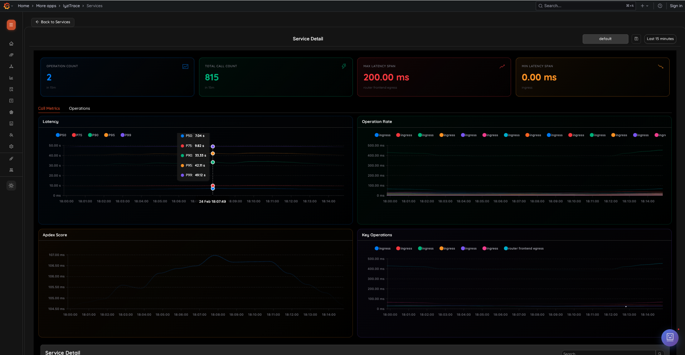

- **Distributed Trace Analysis**: Follow the complete journey of requests across services with detailed Gantt chart timelines, span attributes, and operation type filtering.

  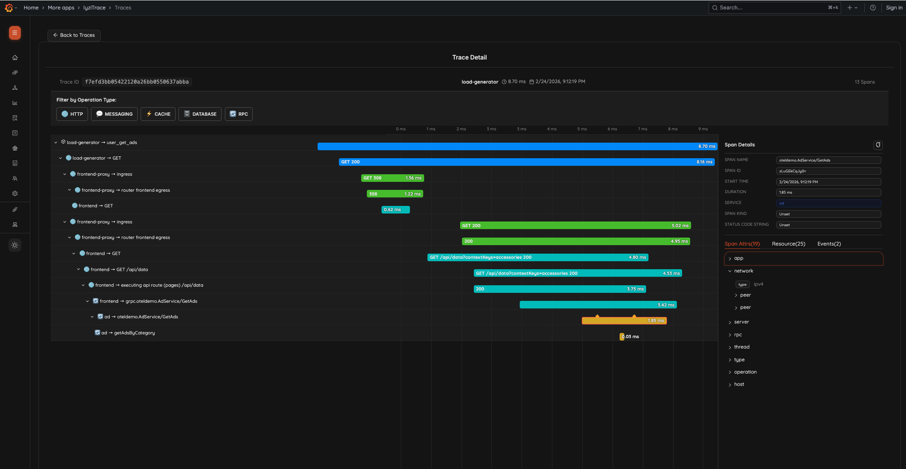

- **AI-Powered Insights**: Get instant system health analysis, anomaly detection, and optimization recommendations from the AI Assistant with context-aware data analysis.

  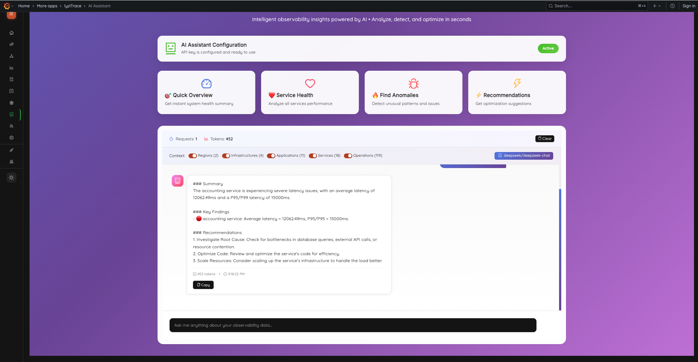

- **Agent Fleet Management**: Manage and monitor your OpenTelemetry collectors with real-time topology views, configuration management, metrics dashboards, and centralized log collection.

  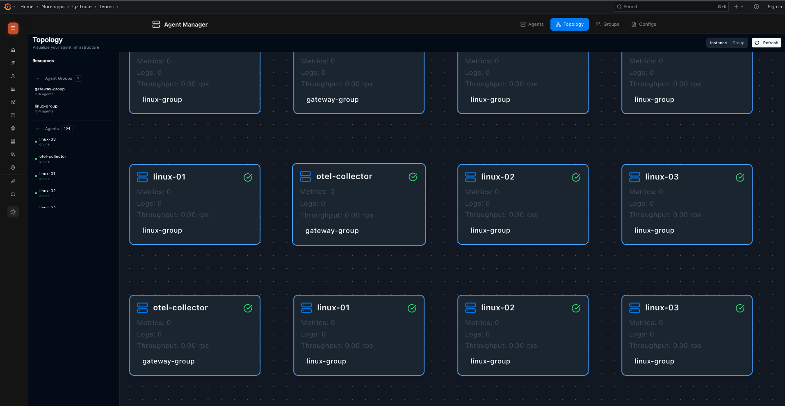

### Built for Modern Platforms

From Kubernetes to serverless, gain real-time visibility with zero heavy lifting:

**Kubernetes & Containers**
- Autoscaling insights
- Pod restart tracking
- Resource bottleneck detection
- OTel + kube integrations without the YAML jungle

**APM & Backend Services**
- Latency, errors, throughput, and saturation in one place
- Trace + log correlation makes RCA straightforward
- Real-time performance monitoring

**SLOs & Alerting**
- Define SLOs on any metric
- Route alerts to Slack/PagerDuty
- Reduce noise with multi-signal rules

### Cost Under Control — No Surprises

Transparent pricing so you always know what you're paying for — no hidden fees, no guesswork, just predictable costs.

**Price by Telemetry**

Pay just for the telemetry you care about. Our pricing is transparent and based on how many logs, spans, and metric data points you send — not bytes stored or seat count. Send all the metadata you need without hidden costs.

**Cost Control**

Use OpenTelemetry agents and the OTEL Collector's pipelines to manage ingestion, downsampling, and routing. Keep costs predictable while retaining what matters.

### World Class Observability

Our customers praise IyziTrace as a powerful platform with excellent user experience and support. IyziTrace simplifies observability for every developer, providing deep insights into logs, metrics, and traces — because details matter.

### Architecture

IyziTrace is deployed as a **Grafana Plugin** and connects to:
- **Tempo**: For distributed tracing data
- **Loki**: For log aggregation and querying
- **Prometheus**: For metrics collection and querying

---

## Platform Features Gallery

IyziTrace provides a comprehensive set of features designed to give you complete visibility into your distributed systems:

### Infrastructure & Service Topology

**1. Overview – Regions & Infrastructures**


See your entire infrastructure at a glance. The overview page presents regions, infrastructure hosts with CPU/memory metrics, services grouped by infrastructure, and operations — all in a single scrollable view with advanced filtering.

- Regions with health status indicators
- Infrastructure cards with real-time CPU & memory usage
- Service cards grouped by infrastructure host
- Operations grouped by service
- Full filter panel with service, type, operation, status, labels, and fields

**2. Overview – Operations & Data Table**

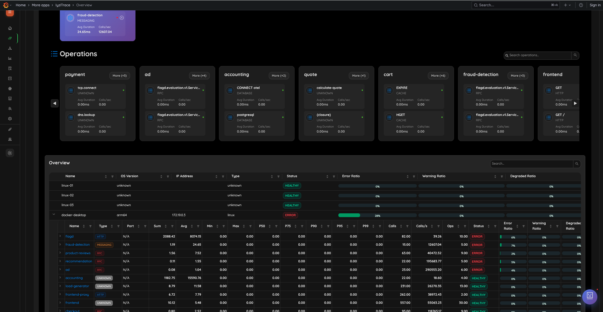

Drill down into operation-level details and view all infrastructure data in a sortable, expandable table. Expand any infrastructure to see its services, and expand services to see operations with detailed metrics.

- Operation cards grouped by service
- Expandable data table with status, error/warning/degraded ratios
- Per-service metrics: Type, Port, Avg, Min, Max, P50–P99, Calls, Calls/s, Operations

**3. Service Map – Infrastructure Topology**


Visualize your entire infrastructure topology with interactive region-based grouping. Click any infrastructure node to see its details including IP address, OS version, type, resource usage, health status, and connected applications.

- Region-based infrastructure grouping
- Infrastructure detail drawer with resources and applications
- Health status indicators (healthy, warning/degraded, error)
- Minimap for navigation

**4. Service Map – Dependency Graph**

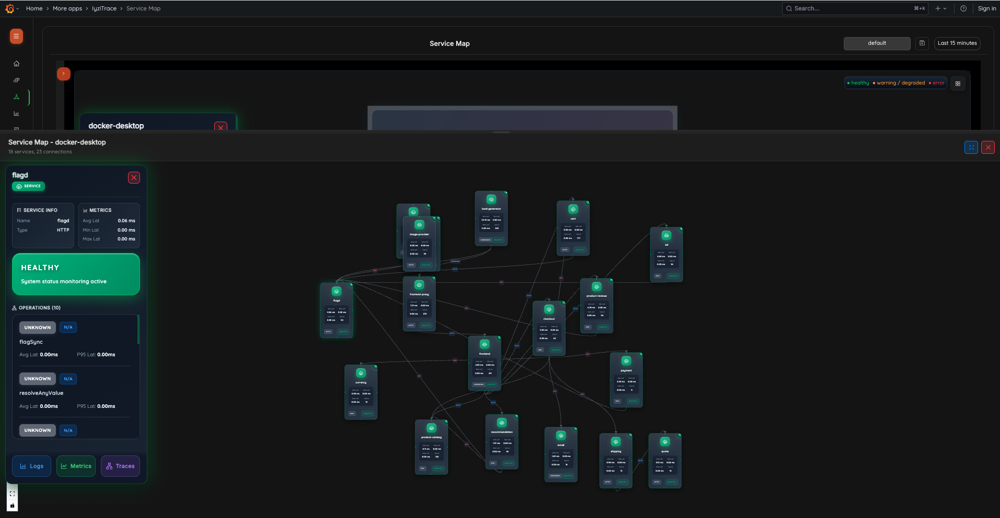

View the complete service dependency graph for any infrastructure. See all services and their interconnections with metrics including average latency, min/max latency, calls count, and status badges.

- Full service dependency visualization
- Service detail drawer with operations list
- Quick navigation to Logs, Metrics, and Traces
- Fullscreen mode for detailed analysis

**5. Service Map – Detailed View**

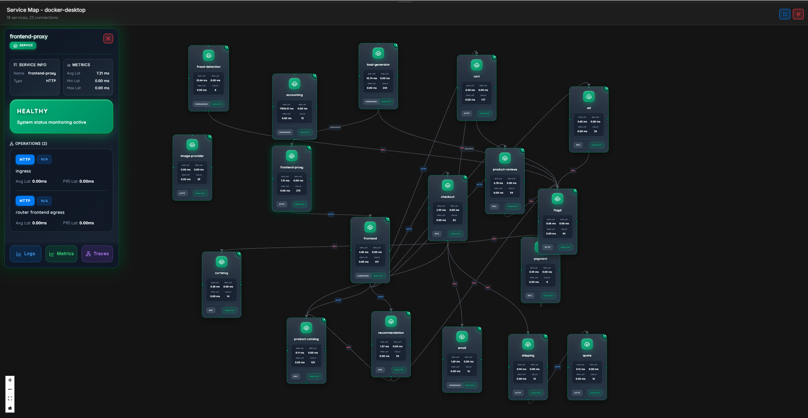

Zoom into specific service connections with detailed metrics per node. Each service card shows average/min latency, calls count, operation types (HTTP, RPC, MESSAGING, etc.), and health status.

- Per-service metrics on every node
- Operation type badges
- Connection lines showing request flow
- Service info panel with full details

### Performance Monitoring

**6. Services Overview**

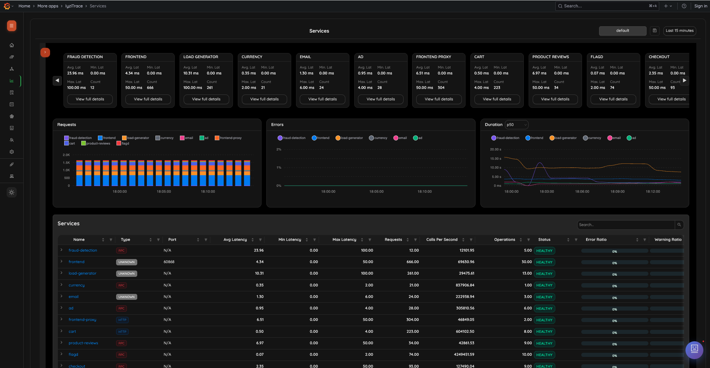

Track all services with summary cards showing average, min, and max latency along with call counts. Below, interactive charts display request rates, error rates, and duration percentiles (P50) over time, with a sortable services table.

- Service summary cards with latency metrics
- Requests chart (stacked bar chart per service)
- Errors chart (line chart per service)
- Duration chart with configurable percentiles
- Sortable services table with Type, Port, Avg/Min/Max Latency, Requests, Calls/s, Operations, Status, and Error Ratio

**7. Service Detail – Call Metrics**


Analyze detailed call metrics for any service. View operation count, total call count, max/min latency spans, and interactive charts for latency percentiles (P50, P75, P90, P95, P99), operation rate, Apdex score, and key operations.

- Summary cards: Operation Count, Total Call Count, Max/Min Latency Span
- Latency chart with P50–P99 percentiles
- Operation Rate chart
- Apdex Score chart
- Key Operations chart

**8. Service Detail – Operations Tab**

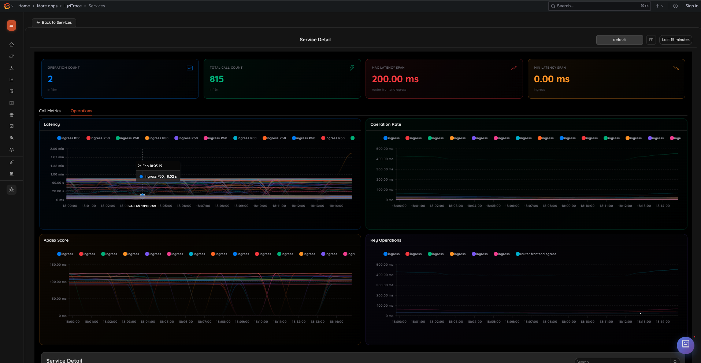

Switch to the Operations tab to see per-operation latency breakdown with P50 tooltips, operation rates, and Apdex scores — all with interactive time-series charts.

- Per-operation P50 latency visualization
- Operation-level performance breakdown
- Time-correlated charts for comparison

### Distributed Tracing

**9. Traces Overview**

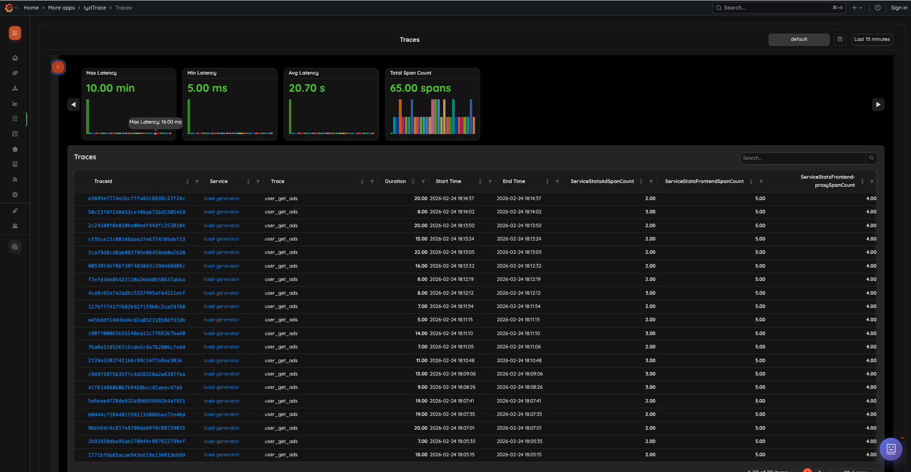

View all traces across your system with summary cards showing max latency, min latency, average latency, and total span count. The trace list includes Trace ID, Service, Trace name, Duration, Start/End Time, and per-service span counts.

- Summary cards with latency statistics and span distribution chart
- Sortable trace table with service span count columns
- Clickable Trace IDs for detailed inspection
- Search and filter capabilities

**10. Trace Detail**


Inspect individual traces with a complete Gantt chart timeline view. Filter by operation type (HTTP, MESSAGING, CACHE, DATABASE, RPC), view parent-child span relationships, and inspect span details including attributes, resources, and events.

- Trace header with root service, duration, timestamp, and span count
- Operation type filter chips
- Gantt chart with color-coded spans and status codes
- Span Details panel: Span Name, Span ID, Start Time, Duration, Service, Span Kind, Status Code
- Expandable attribute groups: app, network, peer, server, rpc, thread, type, operation, host

### Log Management

**11. Centralized Log Explorer**

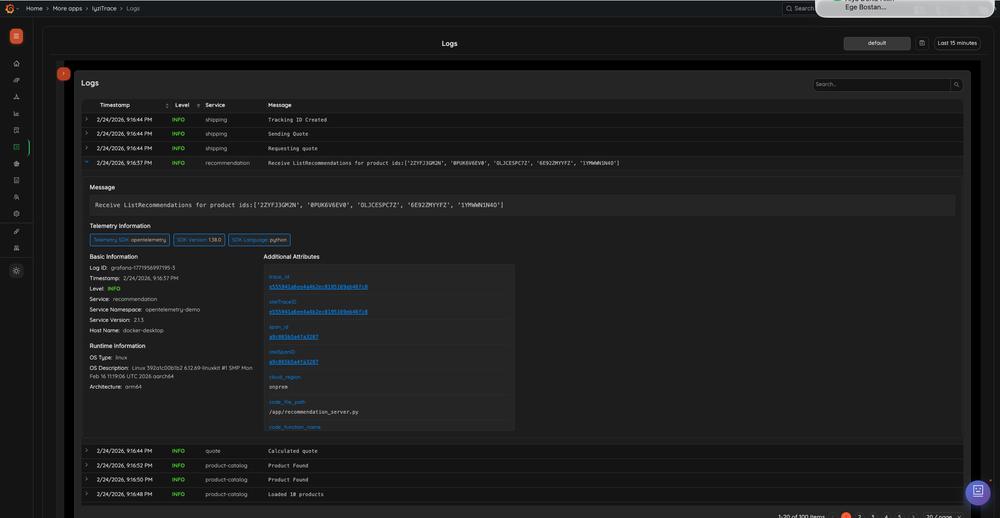

Search, filter, and inspect logs from any service. Expand any log entry to see the full message, telemetry information (SDK, version, language), basic information, runtime details, and additional attributes with clickable trace/span IDs.

- Log list with Timestamp, Level (color-coded), Service, and Message
- Expandable log detail view with structured sections
- Telemetry Information badges (SDK, Version, Language)
- Basic Information: Log ID, Timestamp, Level, Service, Namespace, Version, Host Name
- Runtime Information: OS Type, OS Description, Architecture
- Additional Attributes with clickable trace_id, otelTraceID, span_id, otelSpanID links
- Pagination controls

### AI-Powered Analysis

**12. AI Assistant – Chat Interface**

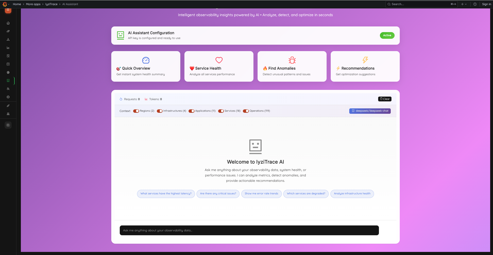

The AI Assistant provides a full-page intelligent analysis interface. Quick action cards (Quick Overview, Service Health, Find Anomalies, Recommendations) give instant insights. Context toggles let you include Regions, Infrastructures, Applications, Services, and Operations data.

- AI Configuration status with Active/Inactive indicator
- Quick action cards for common analyses
- Context toggles for data scope selection
- Model selector (e.g., deepseek/deepseek-chat)
- Suggested questions for quick start
- Request and token usage tracking

**13. AI Assistant – Analysis Response**


AI responses include structured summaries, key findings with severity indicators, and actionable recommendations. Results show token count and timestamp with copy functionality.

- Structured response format: Summary, Key Findings, Recommendations
- Severity-coded findings (🔴 critical, 🟡 warning, 🟢 healthy)
- Copy button for sharing results
- Token count and timestamp metadata

### Agent Management

**14. Agent Manager – Agents List**

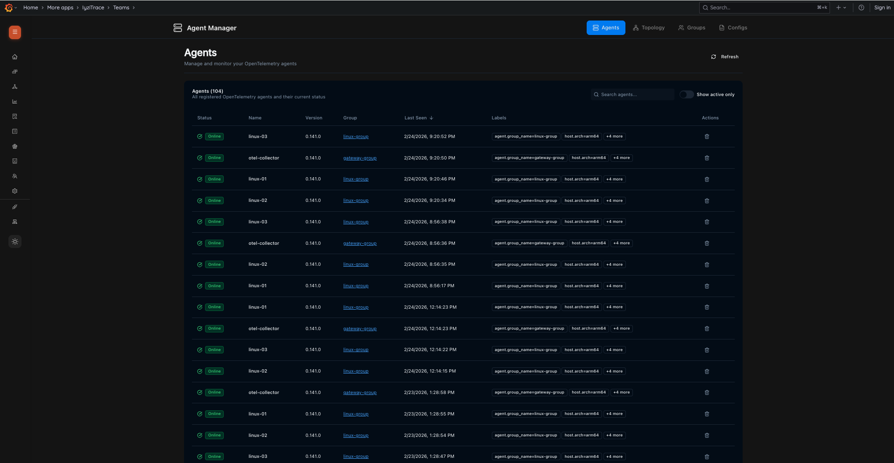

Manage and monitor all registered OpenTelemetry agents. View agent status (Online/Offline), name, version, group assignment, last seen timestamp, and labels. Search, filter by active status, and perform actions on agents.

- Agent list with Status, Name, Version, Group, Last Seen, Labels
- Search and filter controls
- "Show active only" toggle
- Delete action per agent
- Tabs: Agents, Topology, Groups, Configs

**15. Agent Topology**


Visualize your agent infrastructure as interactive topology cards. View agents grouped by instance or group, with metrics (Metrics count, Logs count, Throughput), and a resource tree showing Agent Groups and individual agents with online/offline status.

- Instance and Group view modes
- Agent cards with metrics and group assignment
- Resource sidebar with Agent Groups tree
- Individual agent status indicators

**16. Agent Groups**

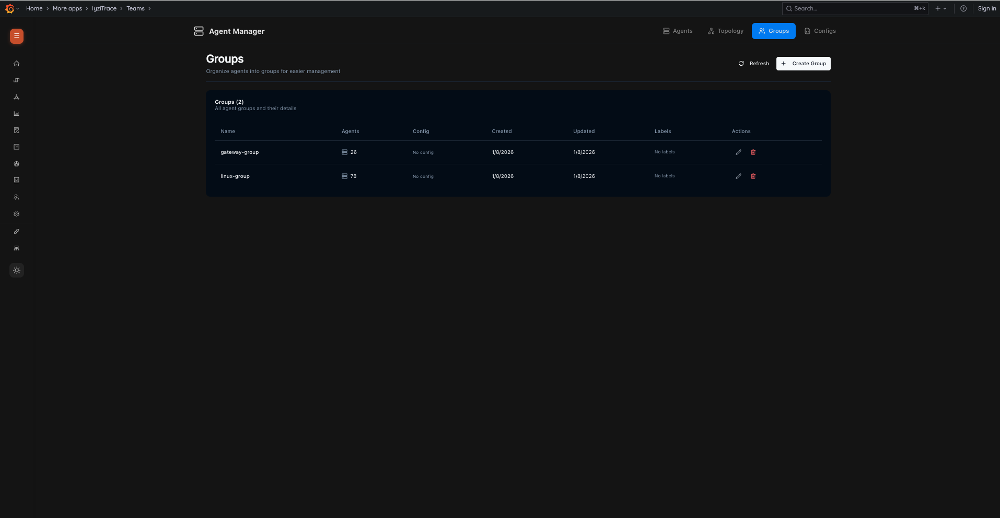

Organize agents into logical groups for easier management. View group name, agent count, configuration assignment, creation/update dates, labels, and perform edit/delete actions.

- Groups table with Name, Agents count, Config, Created, Updated, Labels
- Create Group button
- Edit and Delete actions per group

**17. Agent Configuration**

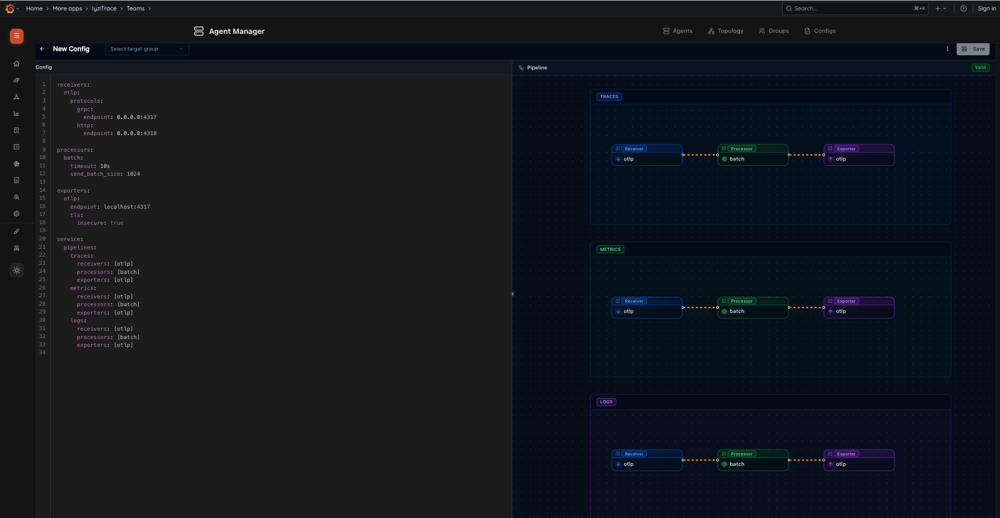

Create and edit OpenTelemetry Collector configurations with a built-in YAML editor and live pipeline visualization. The pipeline view shows Receivers, Processors, and Exporters for Traces, Metrics, and Logs with validation status.

- YAML configuration editor with syntax highlighting
- Live pipeline visualization (Receiver → Processor → Exporter)
- Separate pipeline views for Traces, Metrics, and Logs
- Configuration validation indicator (Valid/Invalid)
- Target group selector and save functionality

**18. Agent Detail – Metrics**

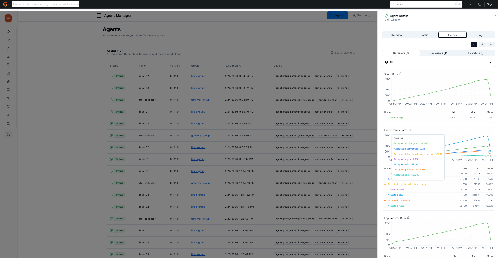

Monitor individual agent performance with detailed telemetry metrics. View Spans Rate, Metric Points Rate, and Log Records Rate over time with interactive charts showing accepted data across receivers.

- Tabs: Overview, Config, Metrics, Logs
- Time range selection (1h, 6h, 24h)
- Receivers, Processors, Exporters breakdown
- Interactive rate charts with Min, Max, Mean statistics

**19. Agent Detail – Logs**

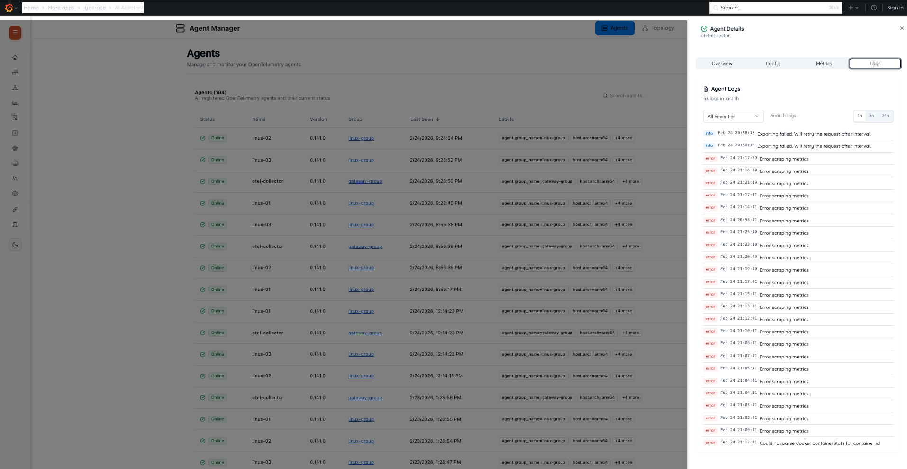

View agent-specific logs with severity filtering and search. Logs show timestamp, severity level (Info, Error), and message content for troubleshooting agent issues.

- Severity filter dropdown
- Search within logs
- Time range selection
- Color-coded log entries by severity

### Inventory Management

**20. Inventory Dashboard**

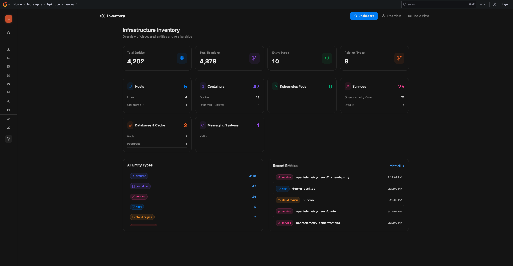

Get a complete overview of all discovered infrastructure entities and their relationships. Summary cards show Total Entities, Total Relations, Entity Types, and Relation Types. Resource breakdown cards display Hosts, Containers, Kubernetes Pods, Services, Databases & Cache, and Messaging Systems.

- Summary cards: Total Entities (4,202), Total Relations (4,379), Entity Types (10), Relation Types (8)
- Resource breakdown: Hosts, Containers, Kubernetes Pods, Services, Databases & Cache, Messaging Systems
- All Entity Types with counts (process, container, service, host, cloud.region, etc.)
- Recent Entities list with type badges and timestamps
- Tabs: Dashboard, Tree View, Table View

**21. Inventory Tree View**

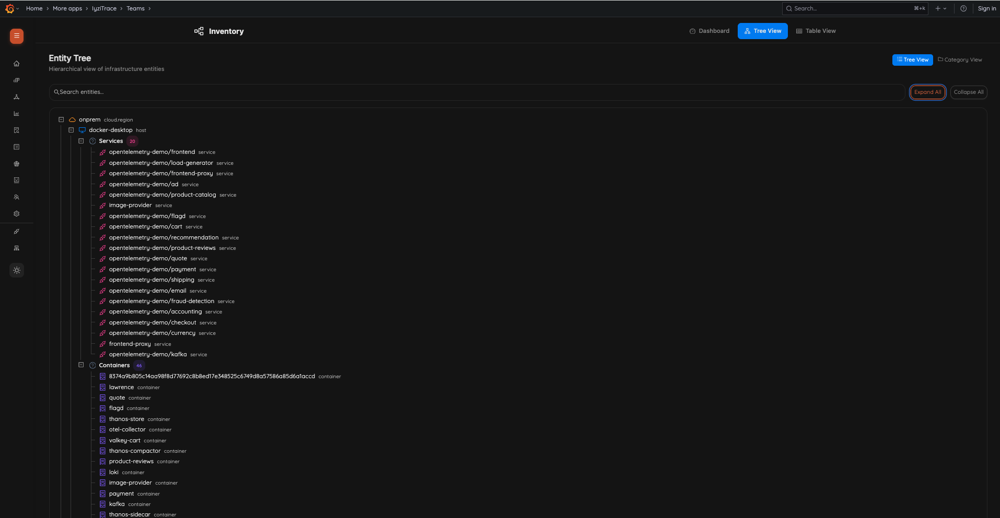

Explore your infrastructure hierarchy in an interactive tree structure. Navigate from cloud regions → hosts → services → containers with expandable nodes. Switch between Tree View and Category View.

- Hierarchical entity tree: cloud.region → host → services → containers
- Expand/Collapse all functionality
- Search across entities
- Tree View and Category View toggle
- Entity type badges with color coding

**22. Inventory Company View**

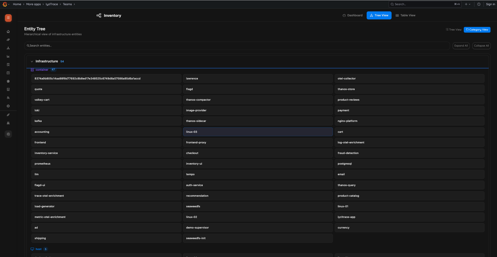

**23. Inventory Service Detail**

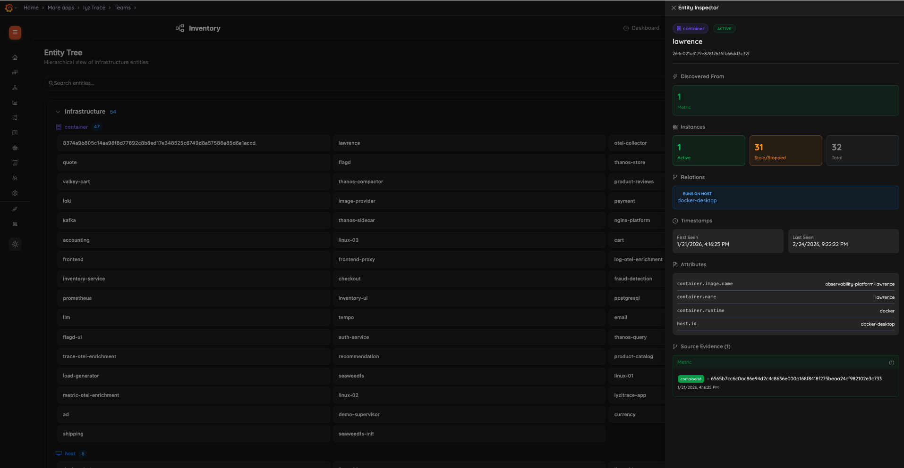

**24. Inventory Table – Entities**

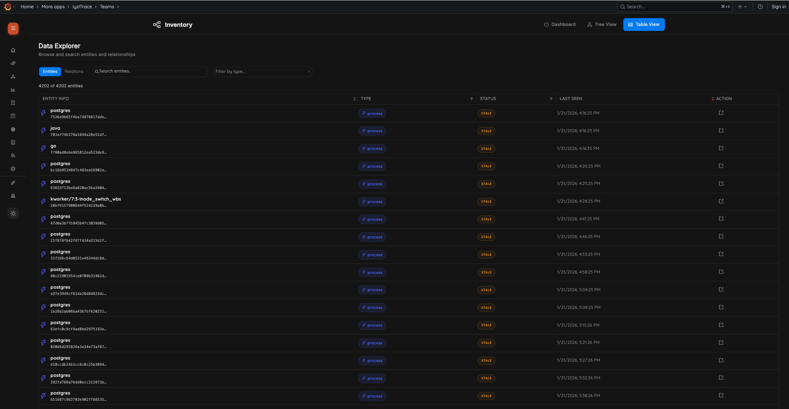

**25. Inventory Table – Relations**

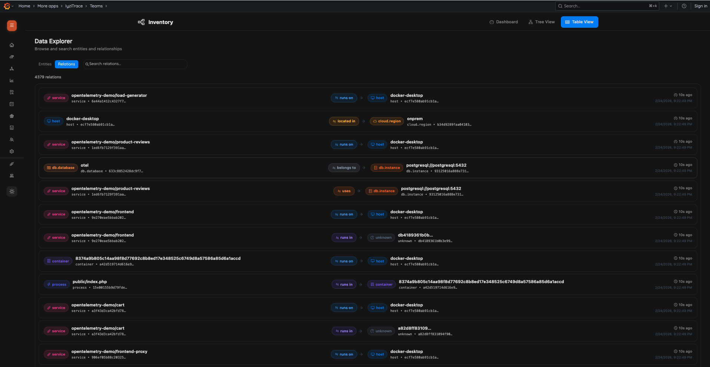

### Customization

**26. Exception Tracking**

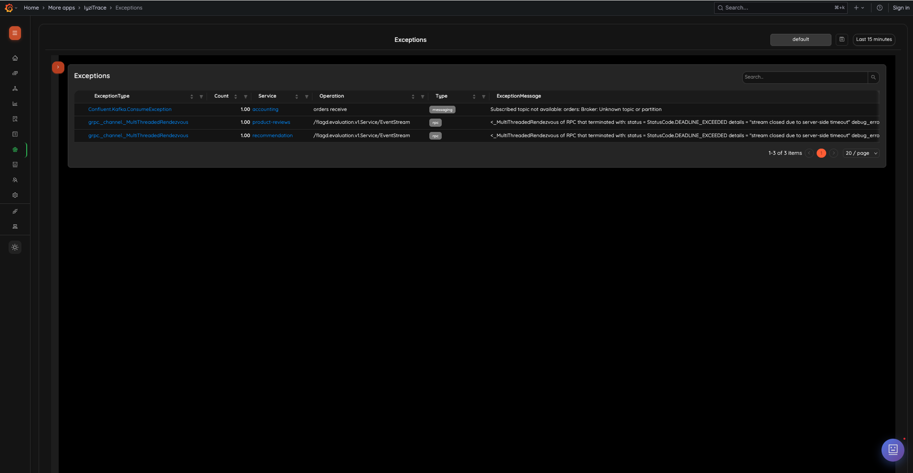

Track and analyze exceptions across services. View ExceptionType, Count, Service, Operation, Type (messaging, rpc, etc.), and ExceptionMessage with search and pagination.

**27. Exception Detail**

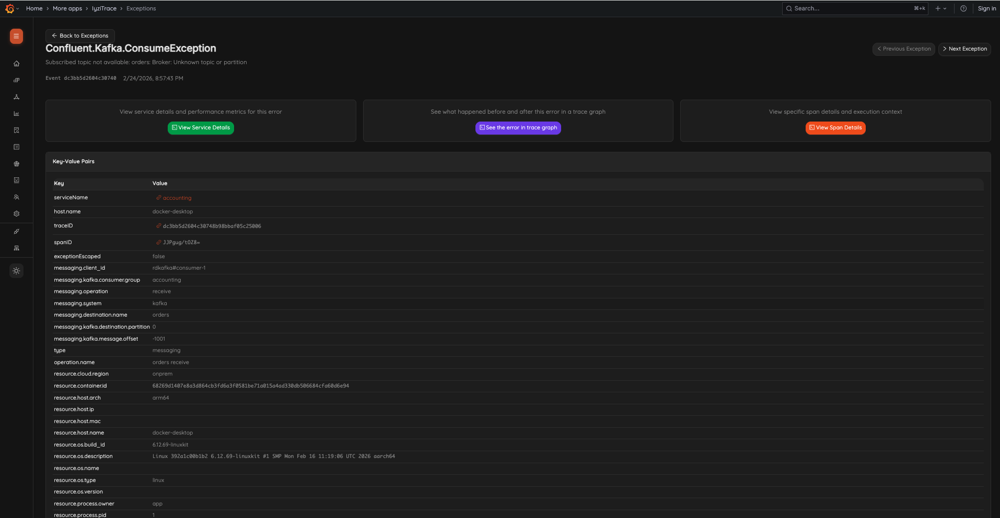

Inspect individual exceptions with full context. Quick action cards link to Service Details, Trace Graph, and Span Details. Key-Value Pairs table shows all span attributes including serviceName, host.name, traceID, spanID, messaging details, resource information, and more.

- Navigation: Previous/Next Exception
- Quick actions: View Service Details, See the error in trace graph, View Span Details
- Complete key-value pairs with clickable trace/span links

---

## Get Started

### Installation

#### Step 1: Install from Grafana Marketplace

1. Log in to your Grafana instance
2. Navigate to **Configuration** → **Plugins**
3. Search for **"IyziTrace"**
4. Click **Install**

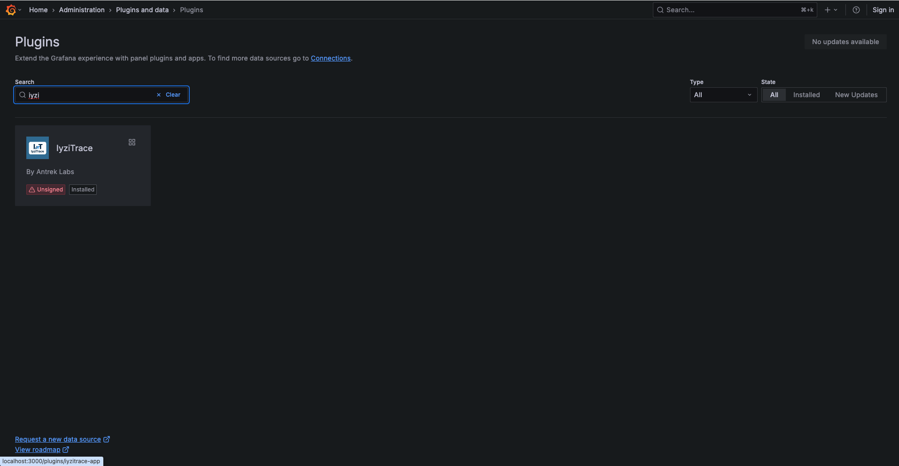

Alternatively, install via CLI:

```bash
grafana-cli plugins install iyzitrace-app
```

#### Step 2: Enable the Plugin

1. Go to **Configuration** → **Plugins**
2. Find **IyziTrace** in your installed plugins
3. Click **Enable**

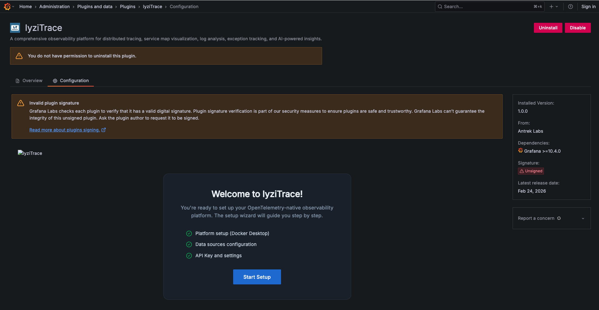

### Setup Wizard

IyziTrace includes a guided setup wizard to get you started quickly:

#### Step 1: Platform Connection

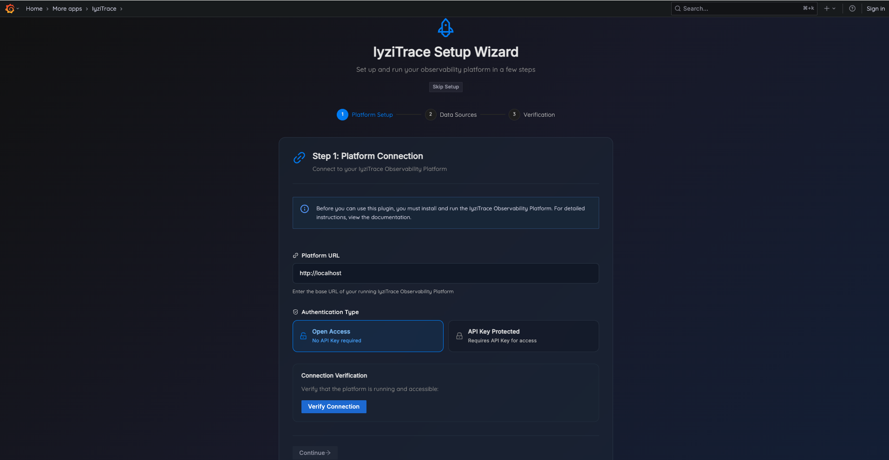

Connect to your IyziTrace Observability Platform:
1. Enter your **Platform URL** (e.g., `http://localhost`)
2. Choose **Authentication Type**: Open Access or API Key Protected
3. If API Key Protected, enter your **Platform API Key**
4. Click **Verify Connection** to test connectivity
5. Click **Continue** to proceed

#### Step 2: Configure Data Sources

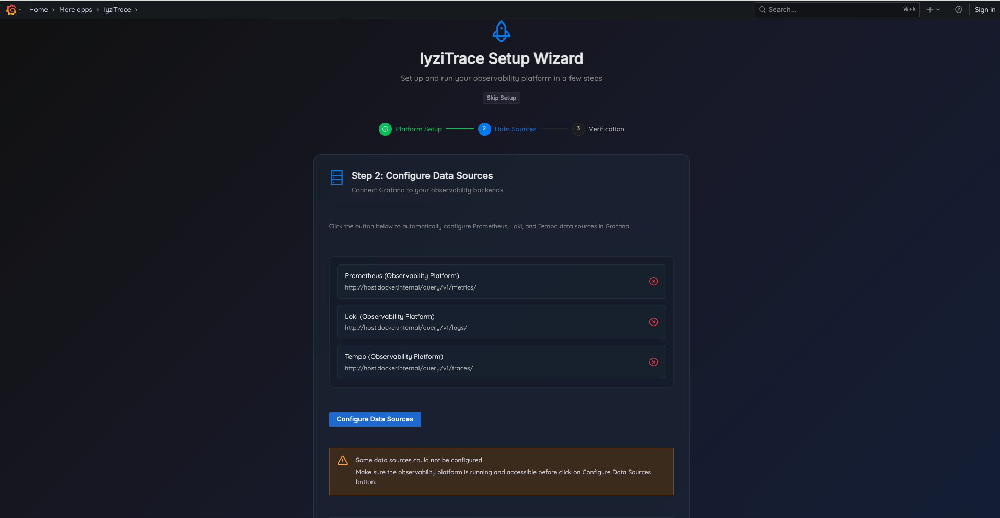

Automatically configure Prometheus, Loki, and Tempo data sources:
1. Review the auto-detected data source endpoints
2. Click **Configure Data Sources** to set them up in Grafana
3. Verify all data sources show green checkmarks
4. Click **Continue** to proceed

#### Step 3: Verification

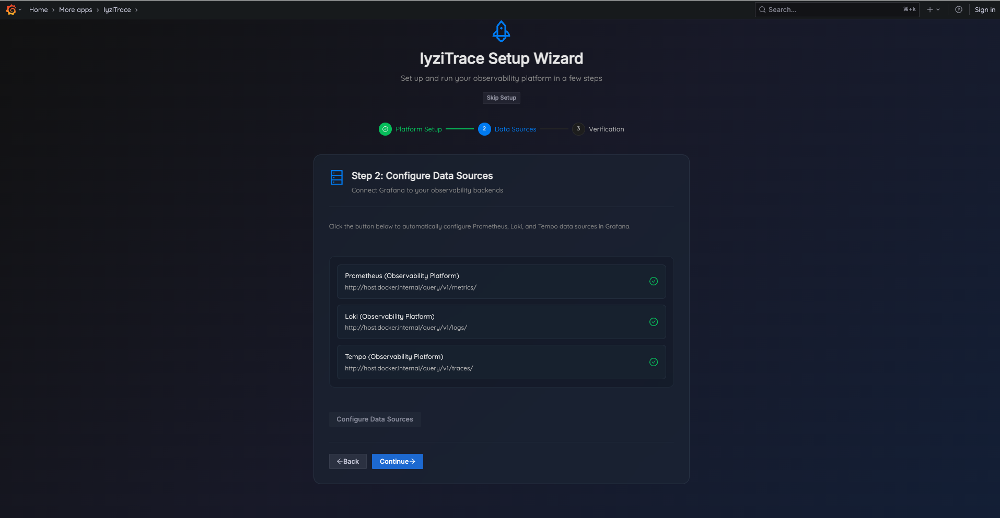

The wizard verifies your setup:
1. Check that all data sources are properly connected
2. Verify data is flowing through the platform
3. Click **Finish** to complete the setup

### Initial Configuration

After completing the setup wizard, you can fine-tune your configuration in **Settings**:

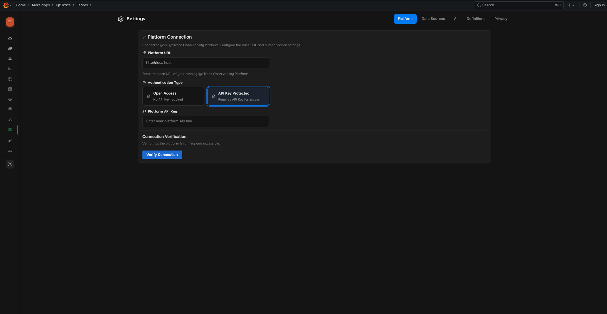

#### Settings Tabs:

1. **Platform**: Configure platform URL and authentication
2. **Data Sources**: Manage Prometheus, Loki, and Tempo connections
3. **AI**: Configure AI assistant with OpenRouter API key and model selection
4. **Definitions**: Define metric and label patterns
5. **Privacy**: Privacy and data handling settings

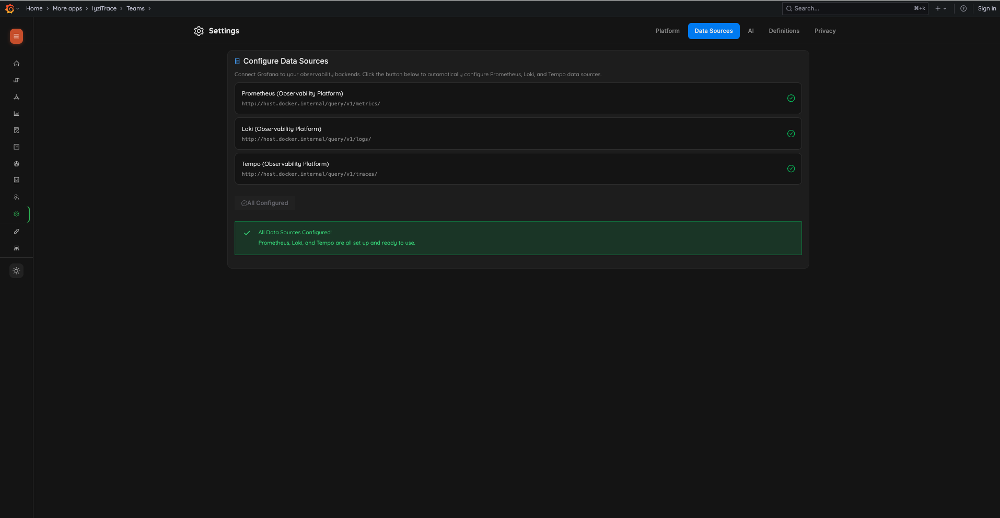

### Quick Start Guide

Once configured, you'll see the **Home Page** with module status and views:

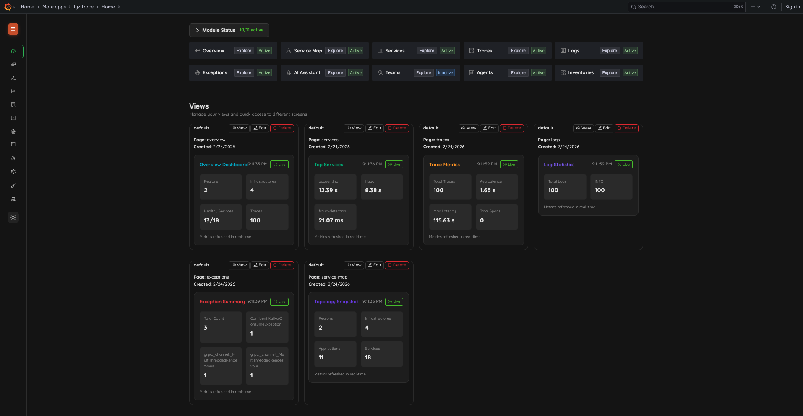

**Module Status** shows active modules (e.g., 10/11 active), and **Section Cards** provide quick navigation:

- **Overview** – Infrastructure & service topology
- **Service Map** – Visual dependency graph
- **Services** – Performance monitoring
- **Traces** – Distributed trace analysis
- **Logs** – Centralized log management
- **Exceptions** – Exception tracking
- **AI Assistant** – AI-powered insights
- **Teams** – User & team management
- **Agents** – OpenTelemetry agent management
- **Inventories** – Infrastructure inventory

Each card shows **Explore** and **Active/Inactive** status. Below, the **Views** section shows saved monitoring views with live metrics.

---

## Key Concepts

### Resources

In IyziTrace, everything revolves around **resources**. A resource represents a component in your system:

- **Infrastructure**: Physical or virtual hosts (e.g., servers, containers)
- **Services**: Applications or microservices running on infrastructure
- **Operations**: Individual functions or API endpoints within services

Resources follow OpenTelemetry semantic conventions and include attributes like:
- `cloud.region`
- `host.name`
- `host.ip`
- `os.type`
- `service.name`
- `service.version`

### Service Infrastructure Mapping

IyziTrace automatically discovers relationships between services and infrastructure:

1. **Auto-Discovery**: Based on `host_name` and `cloud_region` labels
2. **Manual Mapping**: Drag-and-drop orphan services to infrastructure
3. **Persistent Mapping**: Mappings are saved and persist across sessions

### Time Picker

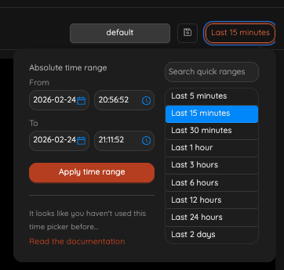

All views support flexible time range selection:

- **Quick Ranges**: Last 5 minutes, 15 minutes, 30 minutes, 1 hour, 3 hours, 6 hours, 12 hours, 24 hours, 2 days
- **Custom Range**: Select specific start and end times with absolute date-time picker
- **Relative Ranges**: "now-1h" to "now"

Time ranges are preserved when navigating between views.

### Filtering

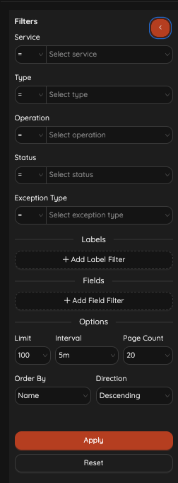

IyziTrace provides powerful filtering capabilities:

- **Service**: Filter by service name
- **Type**: Filter by service type
- **Operation**: Filter by operation name
- **Status**: Filter by health status
- **Exception Type**: Filter by exception type
- **Labels**: Add custom label filters
- **Fields**: Add custom field filters
- **Options**: Limit, Interval, Page Count, Order By, Direction
- **Apply / Reset**: Apply filters or reset to defaults

---

## Features

### Landing Page

The **Home Page** provides an at-a-glance overview of your observability setup.


**Key Features:**
- **Module Status**: Shows active module count (e.g., 10/11 active)
- **Section Status Cards**: Quick view of all modules with Active/Inactive status
  - Overview, Service Map, Services, Traces, Logs, Exceptions, AI Assistant, Teams, Agents, Inventories
- **Quick Navigation**: Click "Explore" on any card to jump to that section
- **Views Section**: Saved monitoring views with live metric panels
  - Overview Dashboard, Top Services, Trace Metrics, Log Statistics, Exception Summary, Topology Snapshot
  - Each view shows live metrics refreshed in real-time

### Overview

The **Overview** page provides a comprehensive view of your entire infrastructure and service topology.


**Layout:**

The page is organized into horizontal scrollable sections:

1. **Regions**: Cloud regions with health indicators (Healthy, Error)
2. **Infrastructures**: Host cards with OS type, CPU usage, memory usage, and Applications button
3. **Services**: Services grouped by infrastructure with type badges, avg duration, and calls/sec
4. **Operations**: Operations grouped by service with expandable details


**Data Table Features:**
- Expandable rows: Infrastructure → Services → Operations
- Columns: Name, OS Version, IP Address, Type, Status, Error Ratio, Warning Ratio, Degraded Ratio
- Service sub-table: Name, Type, Port, Sum, Avg, Min, Max, P50–P99, Calls, Calls/s, Ops, Status

### Service Map

The **Service Map** provides a visual representation of service dependencies and data flow.


**Two Views Available:**

#### 1. Infrastructure Topology Map

Shows infrastructure nodes grouped by region with health status:
- Region-based grouping (e.g., Linux-farm, Onprem)
- Infrastructure cards with health badges (HEALTHY, ERROR)
- Click any node to open detail drawer with:
  - Infrastructure info (IP Address, OS Version, Type)
  - Resources (CPU, Memory, Usage)
  - Health status with monitoring status
  - Applications list
  - "View Services Map" link

#### 2. Service Dependency Map


Detailed service dependency graph showing all connections:
- Service nodes with metrics (Avg Lat, Min Lat, Max Lat, Calls)
- Connection lines showing request flow
- Service detail drawer with:
  - Service Info (Name, Type)
  - Metrics (Avg Lat, Min Lat, Max Lat)
  - Health status
  - Operations list with type badges and latency
  - Quick links: Logs, Metrics, Traces


### Services

The **Services** page provides comprehensive performance monitoring.


**Service Summary Cards:**
- Each service shows: Avg. Lat, Min. Lat, Max. Lat, Count
- "View full details" link for each service

**Performance Charts:**
- **Requests**: Stacked bar chart showing request volume per service
- **Errors**: Line chart showing error rates per service
- **Duration**: Line chart with configurable percentiles (P50, P90, P95, P99)

**Services Table:**
- Columns: Name, Type, Port, Avg Latency, Min Latency, Max Latency, Requests, Calls Per Second, Operations, Status, Error Ratio, Warning Ratio
- Expandable rows to see operations within each service
- Search and sort capabilities

**Service Detail:**


Click any service to see detailed analytics:
- Summary cards: Operation Count, Total Call Count, Max/Min Latency Span
- **Call Metrics tab**: Latency (P50–P99), Operation Rate, Apdex Score, Key Operations
- **Operations tab**: Per-operation latency breakdown


### Traces

The **Traces** page helps you analyze distributed traces across your microservices.


**Summary Cards:**
- Max Latency, Min Latency, Avg Latency, Total Span Count
- Mini chart showing span distribution

**Trace List:**
- Columns: TraceId, Service, Trace, Duration, Start Time, End Time, per-service span counts
- Clickable Trace IDs for detailed view
- Search bar for filtering

**Trace Detail:**


Click any trace to see:
- Trace header: Trace ID, root service, duration, timestamp, total spans
- **Operation Type Filters**: HTTP, MESSAGING, CACHE, DATABASE, RPC
- **Gantt Chart Timeline**: Visual span timeline with:
  - Color-coded spans by status (200, 308, etc.)
  - Parent-child relationship indentation
  - Duration labels on each span
- **Span Details Panel**:
  - Span Name, Span ID, Start Time, Duration
  - Service, Span Kind, Status Code String
  - Tabs: Span Attrs, Resource, Events
  - Expandable attribute groups: app, network, peer, server, rpc, thread, type, operation, host

### Logs

The **Logs** page provides powerful log aggregation and search capabilities.


**Log Stream:**
- Columns: Timestamp, Level (color-coded), Service, Message
- Expandable log entries with detailed view
- Pagination with configurable page size

**Expanded Log Entry:**
- **Message**: Full log message content
- **Telemetry Information**: SDK badges (Telemetry SDK, SDK Version, SDK Language)
- **Basic Information**: Log ID, Timestamp, Level, Service, Service Namespace, Service Version, Host Name
- **Runtime Information**: OS Type, OS Description, Architecture
- **Additional Attributes**: Complete key-value pairs with clickable links for trace_id, otelTraceID, span_id, otelSpanID, cloud_region, code_file_path, code_function_name

### Views

The **Views** section (on the Home page) allows you to save and manage custom monitoring views.


**Creating a View:**
1. Navigate to any page (e.g., Overview, Services, Traces)
2. Apply your desired filters
3. Click **Save View** button
4. Enter a name and description
5. Click **Save**

**View Cards:**
Each saved view shows:
- View name and page type
- Created date
- Live metric panels with real-time data
- View, Edit, Delete actions

**Available View Types:**
- **Overview Dashboard**: Regions, Infrastructures, Healthy Services, Traces
- **Top Services**: Service-specific latency metrics
- **Trace Metrics**: Total Traces, Avg Latency, Max Latency, Total Spans
- **Log Statistics**: Total Logs, log level breakdown
- **Exception Summary**: Total Count, exception type breakdown
- **Topology Snapshot**: Regions, Infrastructures, Applications, Services

### Exceptions

The **Exceptions** page helps you track and analyze errors across services.


**Exception List:**
- Columns: ExceptionType, Count, Service, Operation, Type, ExceptionMessage
- Color-coded type badges (messaging, rpc, etc.)
- Clickable exception types for detail view
- Search and pagination

**Exception Detail:**


Click any exception to see:
- Exception type and message header
- Event ID and timestamp
- **Quick Actions**:
  - View Service Details
  - See the error in trace graph
  - View Span Details
- **Key-Value Pairs**: Complete span attributes including:
  - serviceName, host.name, traceID, spanID
  - Messaging details (client, consumer group, operation, system, destination)
  - Resource details (container.id, host.arch, os.type, os.description)
- Previous/Next Exception navigation

### AI Assistant

The **AI Assistant** provides intelligent insights and recommendations powered by AI.


**Features:**

#### 1. Full-Page Analysis Interface
- **Configuration Status**: API key status (Active/Inactive)
- **Quick Action Cards**: Quick Overview, Service Health, Find Anomalies, Recommendations
- **Context Toggles**: Enable/disable Regions, Infrastructures, Applications, Services, Operations
- **Model Selection**: Choose AI model (e.g., deepseek/deepseek-chat)
- **Usage Tracking**: Request count and token usage

#### 2. Suggested Questions
Pre-built questions for quick start:
- "What services have the highest latency?"
- "Are there any critical issues?"
- "Show me error rate trends"
- "Which services are degraded?"
- "Analyze infrastructure health"

#### 3. AI Analysis Response


Structured responses with:
- **Summary**: Overview of findings
- **Key Findings**: Severity-coded items (🔴 critical, 🟡 warning, 🟢 healthy)
- **Recommendations**: Numbered action items
- Token count and timestamp
- Copy button for sharing

### Agent Manager

The **Agent Manager** provides comprehensive management of OpenTelemetry collectors.


**Agents Tab:**
- All registered agents with Status, Name, Version, Group, Last Seen, Labels
- Search agents and filter by active status
- Delete action per agent
- Click any agent to open the detail drawer

**Agent Detail Drawer:**

The drawer provides four tabs:

1. **Overview**: Agent basic information and status

2. **Config**: Current configuration details
   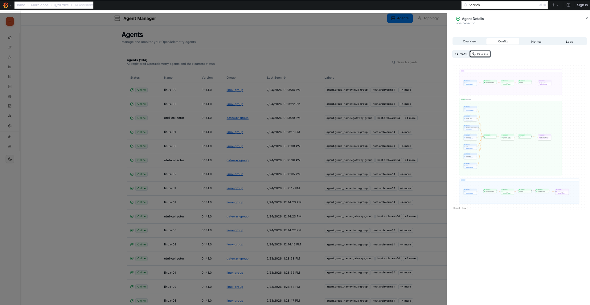

3. **Metrics**: Telemetry performance metrics
   
   - Spans Rate, Metric Points Rate, Log Records Rate
   - Receivers, Processors, Exporters tabs
   - Interactive charts with Min, Max, Mean statistics

4. **Logs**: Agent-specific logs
   
   - Severity filtering (All Severities, Info, Error, etc.)
   - Search within logs
   - Time range selection (1h, 6h, 24h)

**Topology Tab:**


- Visualize agents as interactive topology cards
- Instance and Group view modes
- Resource sidebar with Agent Groups tree
- Per-agent metrics (Metrics, Logs, Throughput)

**Groups Tab:**


- Organize agents into logical groups
- Group details: Name, Agent count, Config, Created, Updated, Labels
- Create, Edit, and Delete groups

**Configs Tab:**


- YAML configuration editor with syntax highlighting
- Live pipeline visualization (Receiver → Processor → Exporter)
- Pipeline views for Traces, Metrics, and Logs
- Validation status indicator

### Inventory Manager

The **Inventory Manager** provides complete infrastructure discovery and relationship tracking.


**Dashboard Tab:**
- Summary cards: Total Entities, Total Relations, Entity Types, Relation Types
- Resource breakdown: Hosts, Containers, Kubernetes Pods, Services, Databases & Cache, Messaging Systems
- All Entity Types with counts
- Recent Entities list with type badges

**Tree View Tab:**


- Hierarchical entity tree (cloud.region → host → services → containers)
- Expand/Collapse all functionality
- Entity search
- Tree View and Category View toggle

**Table View Tab:**


- Tabular view of all entities with sortable columns
- Entity detail view with full attribute list


- View all entity relationships
- Source, Relation Type, and Target columns

---

## Configuration

### Settings

Access settings via the **Settings** menu item.


#### Tabs:

1. **Platform**: Platform URL and authentication settings
2. **Data Sources**: Configure Prometheus, Loki, and Tempo connections
3. **AI**: Configure AI assistant (OpenRouter API key, model, temperature, max tokens)
4. **Definitions**: Define metric and label patterns
5. **Privacy**: Privacy and data handling settings


### Datasources

**Default Datasources:**

- **Prometheus (Observability Platform)**: Primary metrics source
- **Loki (Observability Platform)**: Primary logs source
- **Tempo (Observability Platform)**: Primary traces source

All data sources are automatically configured through the platform with endpoints pointing to the Observability Platform query APIs.

### Definitions

Define how IyziTrace interprets your metrics:

**Label Definitions:**

- **Service Label Name**: Label for service names (default: `service_name`)
- **Operation Label Name**: Label for operation names (default: `span_name`)
- **Type Label Name**: Label for operation types (default: `span_kind`)

**Metric Definitions:**

Add custom metrics for:
- Latency metrics (e.g., `http_request_duration_seconds`)
- Error metrics (e.g., `http_requests_total{status="5xx"}`)
- Throughput metrics (e.g., `http_requests_total`)

### AI Configuration

**API Key:**

- Enter your OpenRouter API key
- Key is stored securely in Grafana
- Required for AI Assistant features

**Model Settings:**

- **Model**: Select AI model (GPT-4, Claude, DeepSeek, etc.)
- **Temperature**: Controls randomness (0.0-1.0)
- **Max Tokens**: Maximum response length

---

## Access Control

### Teams

IyziTrace supports multi-tenancy through teams.

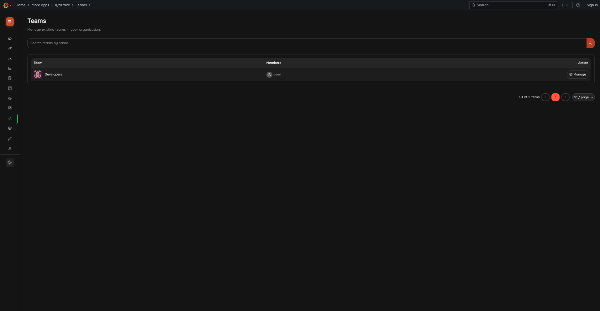

**Creating a Team:**

1. Navigate to **Teams**
2. Click **Create Team**
3. Enter:
   - **Team Name**: Unique identifier
   - **Display Name**: Human-readable name
   - **Description**: Team purpose
4. Click **Save**

**Team Detail:**

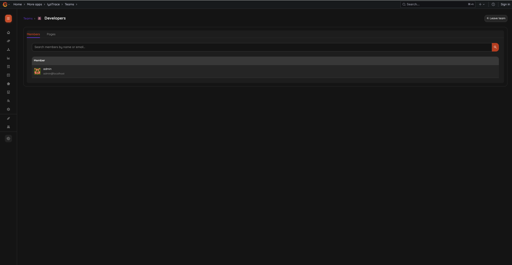

### Page Permissions

Control which pages team members can access:

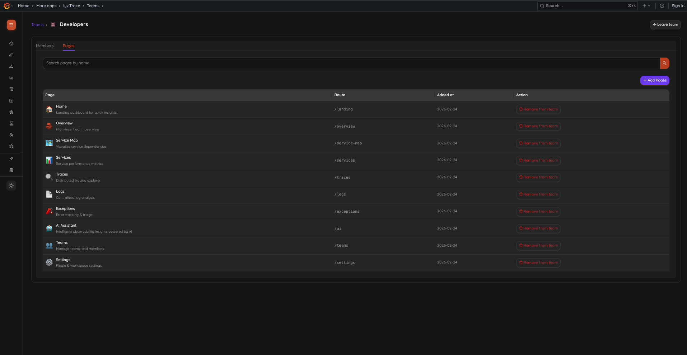

**Available Pages:**

- Home
- Overview
- Service Map
- Services
- Traces
- Logs
- Exceptions
- AI Assistant
- Teams
- Settings
- Agent Manager
- Inventory Manager

**Permission Levels:**

- **Admin**: Can access all pages and manage teams
- **User**: Can access assigned pages only
- **No Access**: If a team has no page assignments, they see all pages (default behavior)

---

## Advanced Features

### Service-Infrastructure Mapping

**Auto-Discovery:**

IyziTrace automatically maps services to infrastructure based on:

1. **Host Name Matching**: If service and infrastructure share same `host_name`
2. **Cloud Region Matching**: If they're in the same `cloud_region`

**Manual Mapping:**

For services that can't be auto-mapped:

1. They appear in "Orphan Services" section
2. Drag the service card
3. Drop it on target infrastructure
4. Mapping is saved persistently

### Orphan Services

**What are Orphan Services?**

Services discovered in your telemetry but not mapped to any infrastructure:

- Services without matching `host_name`
- Services from external systems
- Services in different regions
- Manually instrumented services

**Why Map Them?**

Mapping orphan services:
- Completes your topology view
- Enables infrastructure-level filtering
- Shows complete dependency graph
- Improves resource attribution

### Search and Filter

**Global Search:**

Each section supports search:

- **Real-time**: Results update as you type
- **Case-insensitive**: Matches regardless of case
- **Contains logic**: Matches partial strings
- **Multi-field**: Searches across multiple fields

---

## API Reference

IyziTrace exposes various APIs for programmatic access.

### Datasource APIs

**Prometheus Queries:**

```typescript
import { getQueryData } from './api/provider/prometheus.provider';

const data = await getQueryData('up{job="api"}');
```

**Tempo Queries:**

```typescript
import { getQueryData } from './api/provider/tempo.provider';

const traces = await getQueryData('{}', startTime, endTime, limit);
```

**Loki Queries:**

```typescript
import { getQueryData } from './api/provider/loki.provider';

const logs = await getQueryData(
  '{service_name="api"}', 
  startTime, 
  endTime,
  limit
);
```

### Settings APIs

**Get Plugin Settings:**

```typescript
import { getPluginSettings } from './api/service/settings.service';

const settings = await getPluginSettings();
```

**Save Plugin Settings:**

```typescript
import { savePluginSettings } from './api/service/settings.service';

await savePluginSettings({
  serviceInfraMapping: {...},
  aiConfig: {...}
});
```

### Service Map APIs

**Get Regions:**

```typescript
import { getRegions } from './api/service/service-map.service';

const regions = await getRegions(filterModel);
```

**Get Orphan Services:**

```typescript
import { getOrphanServices } from './api/service/service-map.service';

const orphans = await getOrphanServices(filterModel);
```

### AI APIs

**Ask AI:**

```typescript
import { askAI } from './api/service/ai.service';

const response = await askAI(
  'What services have high error rates?',
  context
);
```

---

## FAQ

**Q: How do I start sending data to IyziTrace?**

A: Use the Setup Wizard to configure your platform connection and data sources. Then configure your applications to send:
- Traces to Tempo (via OTLP)
- Logs to Loki
- Metrics to Prometheus

**Q: Why don't I see my services?**

A: Ensure:
1. Your datasources are connected (check Settings → Data Sources)
2. Data is being sent to Prometheus/Tempo/Loki
3. Metrics contain required labels (`service_name`, etc.)
4. Check definitions in Settings → Definitions match your label names

**Q: How do I map orphan services?**

A: Drag the service from "Orphan Services" section and drop it on the target infrastructure card.

**Q: Can I use IyziTrace without AI features?**

A: Yes! AI Assistant is optional. All core features work without it.

**Q: How do I manage OpenTelemetry agents?**

A: Navigate to Agent Manager from the sidebar. You can view all agents, organize them into groups, create/edit configurations, monitor metrics, and view logs.

**Q: What is the Inventory Manager?**

A: The Inventory Manager automatically discovers and tracks all infrastructure entities (hosts, containers, services, cloud regions, etc.) and their relationships. It provides Dashboard, Tree View, and Table View for exploring your infrastructure.

**Q: How are permissions enforced?**

A: Permissions are enforced through team-based access control. Admins see everything; team users see only assigned pages.

**Q: Can I export my data?**

A: Yes:
- Tables support CSV export
- Traces can be exported as JSON
- Use the datasource APIs to fetch raw data

**Q: How do I troubleshoot missing infrastructure?**

A: Check that:
1. Prometheus is scraping `__inv_base` metric
2. Host inventory is being collected
3. Required labels (`host_name`, `cloud_region`) are present

**Q: What OpenTelemetry version is supported?**

A: IyziTrace supports OpenTelemetry 1.0+ and is compatible with OTLP protocol.

**Q: Can I customize metric definitions?**

A: Yes! Go to Settings → Definitions to add custom metric patterns.

**Q: How do I configure alerts?**

A: Alerts are managed through Grafana's native alerting system. Create alert rules based on your datasources.

---

## Troubleshooting

### Common Issues

#### 1. "No data found"

**Symptoms**: Empty pages, no services, no traces

**Solutions**:
- Verify datasources are connected and healthy
- Check that applications are sending data
- Confirm time range includes data
- Review datasource logs for errors

#### 2. "Orphan services not disappearing after mapping"

**Symptoms**: Mapped services still show in orphan section

**Solutions**:
- Refresh the page
- Check plugin settings were saved
- Verify mapping API call succeeded
- Clear browser cache

#### 3. "AI Assistant not responding"

**Symptoms**: AI chat shows errors or no response

**Solutions**:
- Verify API key is configured
- Check OpenRouter account has credits
- Test API key in OpenRouter dashboard
- Review browser console for errors

#### 4. "Services not auto-mapping"

**Symptoms**: Expected services appear as orphans

**Solutions**:
- Verify `host_name` label matches infrastructure
- Check `cloud_region` matches
- Ensure both service and infrastructure exist
- Review auto-discovery logic in service-map.service.ts

#### 5. "Agent Manager not showing agents"

**Symptoms**: Agent list is empty

**Solutions**:
- Verify OpenTelemetry agents are configured with OpAMP
- Check agent connectivity to the platform
- Verify platform URL is correct in Settings
- Review agent logs for connection errors

#### 6. "Inventory showing no entities"

**Symptoms**: Inventory dashboard shows zero entities

**Solutions**:
- Verify the platform is running and accessible
- Check that telemetry data is being sent
- Ensure infrastructure discovery is configured
- Review platform logs for errors

### Debug Mode

Enable debug logging:

```javascript
// In browser console
localStorage.setItem('debug', 'iyzitrace:*');
```

This will log detailed information about:
- API calls
- Data fetching
- Rendering
- State changes

### Getting Help

For additional support:

1. Check this documentation
2. Review [GitHub Issues](https://github.com/iyzitrace/iyzitrace)
3. Contact support team
4. Join community discussions

---

## Navigation

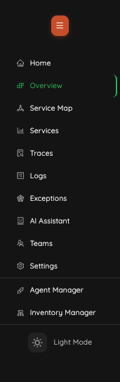

IyziTrace provides a clean sidebar navigation with access to all modules:

- 🏠 Home
- 📊 Overview
- 🔗 Service Map
- 📈 Services
- 📋 Traces
- 📝 Logs
- ⚠️ Exceptions
- 🤖 AI Assistant
- 👥 Teams
- ⚙️ Settings
- 🔧 Agent Manager
- 📦 Inventory Manager
- 🌓 Light Mode toggle

---

## Meta

**Version**: 2.0.0

**License**: Proprietary

**Questions? Comments?**

Send them to: support@iyzitrace.com

---

## Start Observing in Minutes

No credit card required. Start your observability journey today!

**Ready to get started?**

1. Install the IyziTrace plugin from Grafana Marketplace
2. Run the Setup Wizard to configure platform and data sources
3. Start sending telemetry data
4. Explore your systems with powerful visualizations
5. Manage your agents with the Agent Manager
6. Track your inventory with the Inventory Manager

**Need help?** Contact us at support@iyzitrace.com

---

## Legal & Compliance

- [Terms and Conditions](https://iyzitrace.com/legal/terms)
- [Privacy Policy](https://iyzitrace.com/legal/privacy)
- [Data Processing Agreement](https://iyzitrace.com/legal/dpa)
- [Vulnerability Disclosure](https://iyzitrace.com/legal/vulnerability-disclosure)

---

*©2026 IYZI Trace Inc. Built with ❤️ by the IyziTrace Team*
